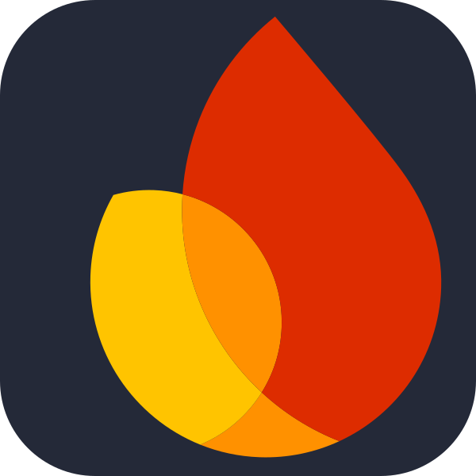

# Hello, I'm Khian Victory👋
I'm a Full-Stack Web Developer passionate about turning ideas into reality. I focus on understanding my clients' needs and creating solutions that deliver value for both clients and users. My goal is to deliver products that looks great, solve real problems, and provide practical, user-friendly solutions for clients and users.

---

   	

  
  
  
  

---

    

  
  
  
  
  
  
  

---

    

  
  
  
  

---

    

  
  
  
  

---

   	

   	

